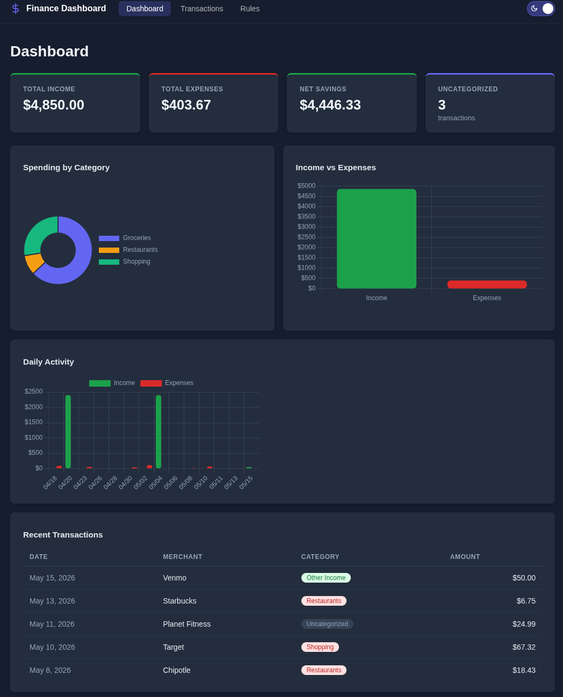
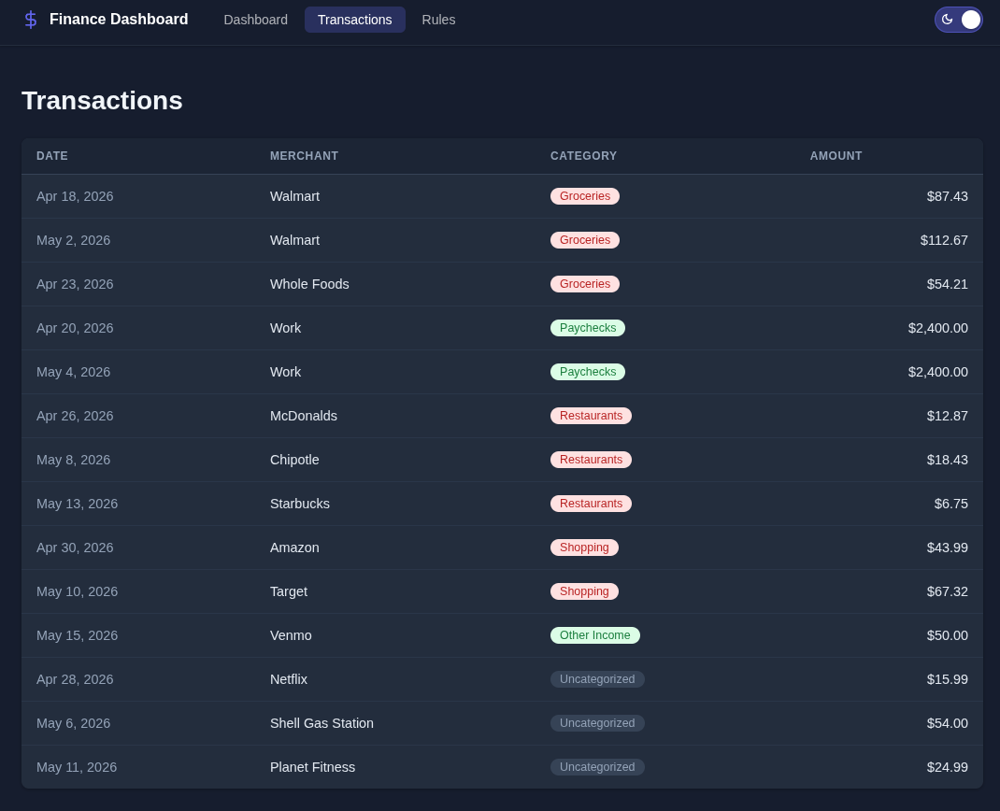
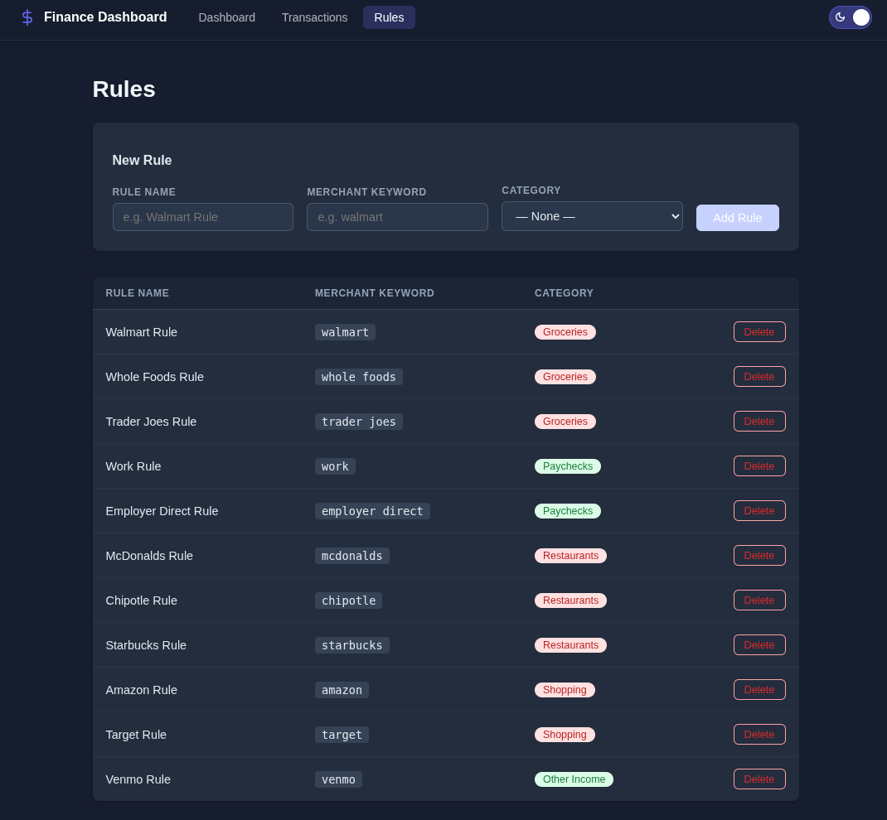

# Personal Finance Dashboard

A full-stack personal finance tracking application for managing transactions, categorizing spending, and visualizing financial data.

## Features

- **Dashboard** — summary cards (income, expenses, net savings), spending-by-category donut chart, income vs. expenses bar chart, daily activity chart, and a recent transactions table
- **Transactions** — view all transactions in a sortable table with category badges and color-coded amounts
- **Rules** — create keyword-based rules that automatically categorize transactions by merchant name
- **Dark mode** — toggle between light and dark themes; preference is persisted across sessions
- **Auto-categorization** — new transactions are matched against rules on creation and assigned a category automatically

## Screenshots

### Dashboard


### Transactions


### Rules


## Tech Stack

| Layer | Technology |
|---|---|
| Frontend | Angular 21, TypeScript 5.9, Chart.js 4 |
| Backend | ASP.NET Core 8 (Web API) |
| ORM | Entity Framework Core 8 |
| Database | SQL Server |
| API Docs | Swagger / OpenAPI |

## Project Structure

```
PersonalFinanceDashboard/
├── backend/
│   └── FinanceDashboard/
│       ├── Controllers/        # REST API endpoints
│       ├── Data/               # DbContext and seed data
│       ├── Migrations/         # EF Core migrations
│       ├── Models/             # Entity models
│       └── Services/           # Business logic
└── frontend/
    └── src/app/
        ├── components/         # Dashboard, Transactions, Rules
        ├── models/             # TypeScript interfaces
        └── services/           # HTTP + theme services
```

## Getting Started

### Prerequisites

- [.NET 8 SDK](https://dotnet.microsoft.com/download/dotnet/8.0)
- [Node.js 20+](https://nodejs.org/)
- SQL Server (local or remote)

### 1. Configure the database

Copy the example config and fill in your SQL Server connection string:

```bash
cp backend/FinanceDashboard/appsettings.example.json backend/FinanceDashboard/appsettings.json
```

Edit `appsettings.json`:

```json
{
  "ConnectionStrings": {
    "DefaultConnection": "Server=localhost;Database=FinanceDashboard;User Id=sa;Password=YourPassword;TrustServerCertificate=True;"
  }
}
```

### 2. Run the backend

```bash
cd backend/FinanceDashboard
dotnet run
```

The API starts on `http://localhost:5265`. Swagger UI is available at `http://localhost:5265/swagger`.

On first run, EF Core applies migrations and seeds the database with sample categories, rules, and transactions automatically.

### 3. Run the frontend

```bash
cd frontend
npm install
npm start
```

The app opens at `http://localhost:4200`.

## API Endpoints

| Method | Endpoint | Description |
|---|---|---|
| GET | `/api/transactions` | List all transactions |
| POST | `/api/transactions` | Create a transaction (auto-categorized) |
| PUT | `/api/transactions/{id}` | Update a transaction |
| DELETE | `/api/transactions/{id}` | Delete a transaction |
| GET | `/api/categories` | List all categories |
| POST | `/api/categories` | Create a category |
| GET | `/api/rules` | List all rules |
| POST | `/api/rules` | Create a rule |
| DELETE | `/api/rules/{id}` | Delete a rule |
